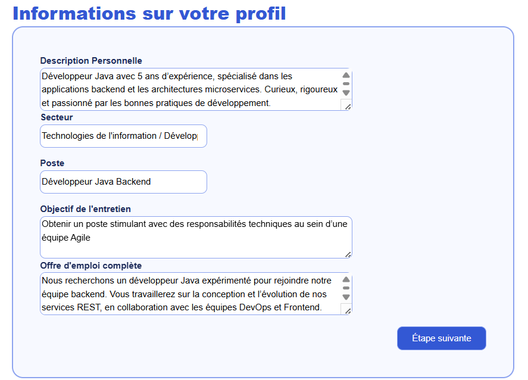
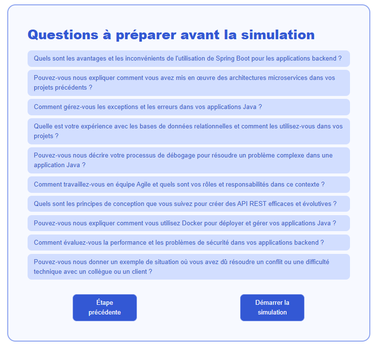
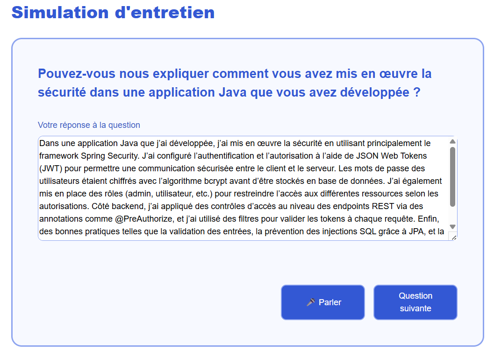
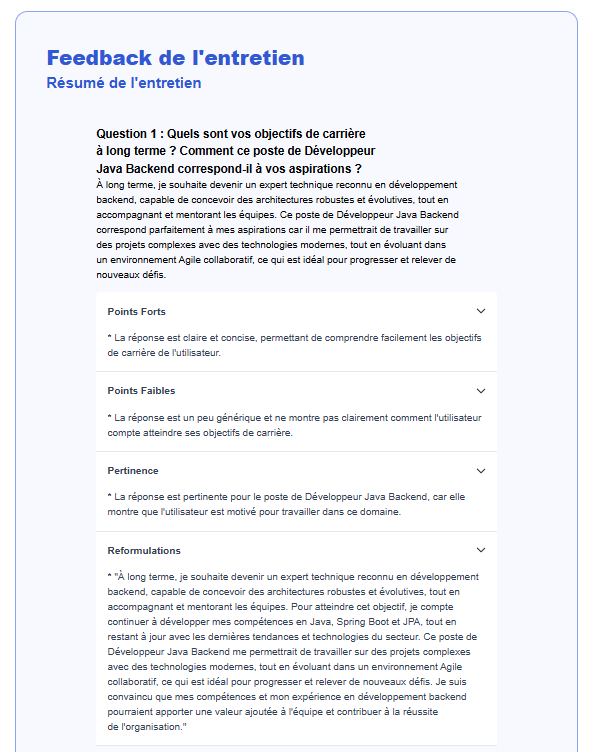

# 🧠 Interview AI Assistant

Une application web alimentée par l'IA pour vous aider à **préparer vos entretiens d'embauche de manière personnalisée, interactive et efficace**.

Lien vers la démo : https://interview-ai-assistant-1w8p.vercel.app/

---

## 🚀 Fonctionnalités principales

### 1. 📝 Création du profil utilisateur

Dès l’arrivée sur la plateforme, l’utilisateur complète un **formulaire de profil** pour donner du contexte à l’IA :

- Secteur d’activité
- Poste visé
- Objectifs de l'entretien

> 💡 **Alternative** : Un formulaire plus libre est aussi proposé avec :
>
> - Une zone de texte pour **coller une offre d’emploi**
> - Une zone de texte pour **se décrire librement** (compétences, parcours, motivations, etc.)

Ces informations sont **enregistrées dans une base de données** pour permettre un suivi dans le temps.

---

### 2. 🎯 Génération des questions à préparer

L’IA utilise les informations du profil pour **suggérer des questions d’entretien personnalisées** à préparer :

- Questions classiques liées au poste
- Questions comportementales
- Mise en situation

L'utilisateur peut **prendre le temps qu’il souhaite** pour s’y préparer.

---

### 3. 🎤 Simulation d’entretien

Quand l’utilisateur est prêt, il peut lancer une **simulation interactive** :

- L’IA joue le rôle du recruteur.
- L’utilisateur répond à l’écrit ou **à l’oral** (grâce au module **voice-to-text** intégré).
- L’entretien évolue dynamiquement en fonction des réponses.

Toutes les interactions sont **enregistrées sous forme de script texte**, appelé **`InterviewRecord`**.

---

### 4. 📊 Feedback et amélioration

Après l’entretien, l’IA analyse chaque réponse enregistrée pour fournir :

- Un **feedback constructif et personnalisé**
- Des **propositions de reformulations** plus percutantes
- Un **rapport téléchargeable au format PDF**

PDF récapitulatif des feedbacks et de l'interview
[Télécharger le rapport PDF](public/exemple_pdf_interview.pdf)

---

## 🧩 Idées d’amélioration pour le formulaire

Voici quelques suggestions supplémentaires pour rendre le formulaire encore plus efficace :

- ✅ Un **sélecteur de niveau d’expérience** (Junior / Confirmé / Expert)
- 📎 Possibilité d’**uploader un CV** pour en extraire automatiquement les informations
- 🎯 Objectif professionnel (type : “Je souhaite évoluer vers un poste de...”) pour mieux adapter les questions
- 💬 Préférences linguistiques (français / anglais) pour adapter la langue de l’entretien
- 🔁 Champs facultatifs pré-remplis basés sur le CV ou une offre d’emploi

---

## 📦 Stack technique (à adapter si nécessaire)

- Frontend : React / Next.js
- Backend : Node.js / Express
- IA : OpenAI GPT / Whisper (Voice-to-text)
- Base de données : PostgreSQL / MongoDB
- Authentification : Supabase / Auth0 / Firebase
- PDF Generation : jsPDF / Puppeteer

---

## 📌 Roadmap

- [x] Formulaire utilisateur contextuel
- [x] Génération dynamique des questions
- [x] Simulation d’entretien avec IA
- [x] Module voice-to-text
- [x] Analyse des réponses et feedback
- [x] Génération d’un rapport PDF
- [x] Interface utilisateur responsive
- [x] Historique des entretiens
- [ ] Choix du modèle d'IA utilisé
- [ ] Personnalisation de l'entretien (nombre de questions, difficulté, entretien technique, entretien humain)

---

## 📷 Captures d'écran

Ajoutez ici des captures pour illustrer :

1. Le formulaire utilisateur
2. Les questions proposées
3. La simulation d’entretien
4. Le rapport de feedback

---

## 🤝 Contribuer

Les contributions sont bienvenues ! N'hésitez pas à ouvrir une issue ou une pull request.

---

## 📃 Licence

Ce projet est sous licence MIT.

---
